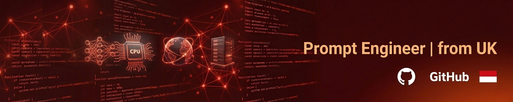

<!-- ## Hello 👋, I'm Mohammad Luqman Hakim  -->

<h2 align="left">Hey 👋 What's up?</h2>

###

My name is Mohammad Luqman Hakim and I'm a Fullstack GPT 😎 from UK (uwong klaten).

<!-- ###

<h2 align="left">About me</h2>

###

✨ Creating bugs since ... 📚 I'm currently learning ... 🎯 Goals: ... 🎲 Fun fact: ...
 -->

<!-- ###

  
  
  
  

### -->

<h3 align="left">Skill</h3>

###

  
  
  
  
  
  
  
  
  
  
  
  
  
  
  
  
  
  
  
  
  
  
  <!-- 
   -->
  <!--  -->
  <!--  -->
  <!--  -->
  <!--  -->
  
  
  
  
  

###

<picture>
  <source media="(prefers-color-scheme: dark)" srcset="https://raw.githubusercontent.com/mhluck/mhluck/output/pacman-contribution-graph-dark.svg">
  <source media="(prefers-color-scheme: light)" srcset="https://raw.githubusercontent.com/mhluck/mhluck/output/pacman-contribution-graph.svg">
  
</picture>

###
<!--
**mhluck/mhluck** is a ✨ _special_ ✨ repository because its `README.md` (this file) appears on your GitHub profile.

Here are some ideas to get you started:

- 🔭 I’m currently working on ...
- 🌱 I’m currently learning ...
- 👯 I’m looking to collaborate on ...
- 🤔 I’m looking for help with ...
- 💬 Ask me about ...
- 📫 How to reach me: ...
- 😄 Pronouns: ...
- ⚡ Fun fact: ...
-->
